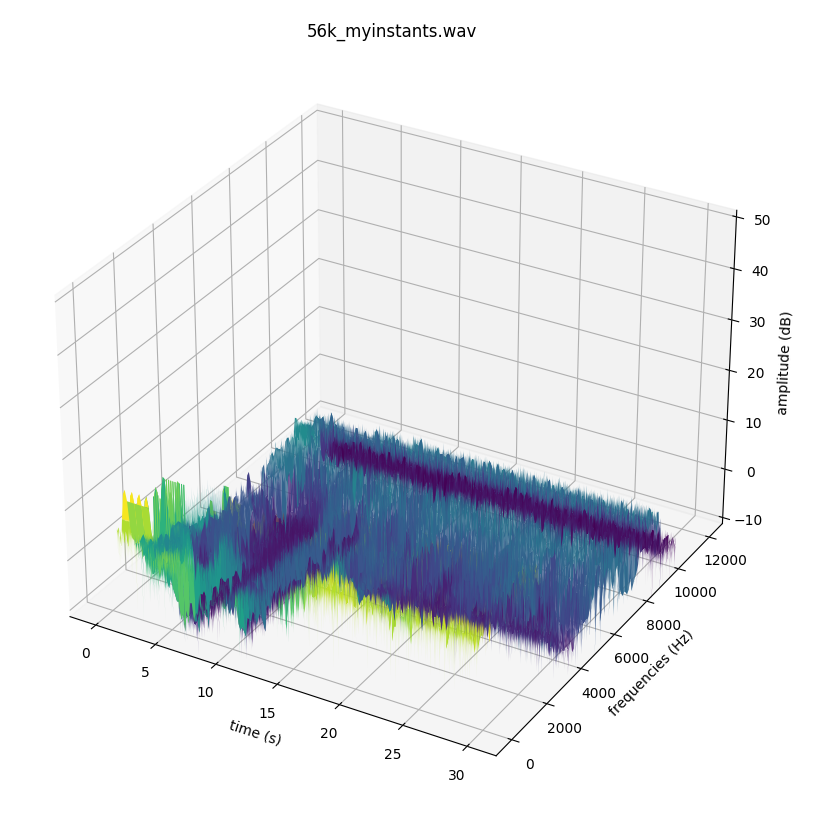
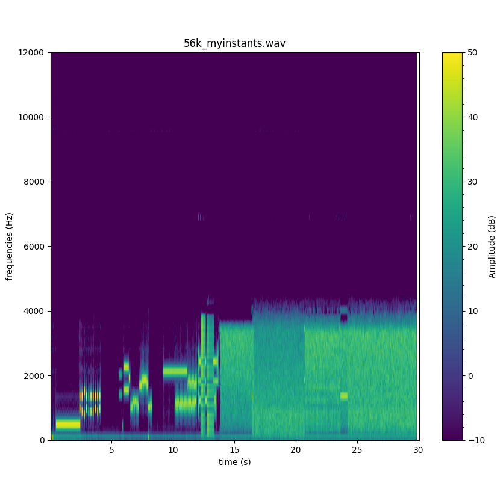

# 2D and 3D Audio Spectogram using Python

This Python project aims to plot audio spectrograms in 2D and 3D. A spectrogram is a visual representation of the spectral intensity of an audio signal as a function of time. It is a useful tool for analyzing and visualizing the temporal and frequency characteristics of an audio signal.

## Installation

1. Clone the project repository to your local environment:

   ```bash
   git clone git@github.com:lrgsouza/audio_spectogram_with_python.git
   ```

2. Navigate to the project directory:

   ```bash
   cd audio_spectogram_with_python
   ```

3. Create and activate a virtual environment (optional but recommended):

   ```bash
    python3 -m venv venv
    source venv/bin/activate
   ```

4. Install the project dependencies:

   ```bash
    pip install -r requirements.txt
   ```

## Usage

Run the command bellow in your terminal:
   ```bash
    python main.py
   ```
This will generate and display the spectrograms of the default audio file.
If you want to generate the spectrograms with a custom audio file, change the variable _audio_file_, as bellow:

```python
audio_file = 'custom_audio.wav'
```

## Results

<table>
  <tr>
    <td align="center">
        <h1>3D Result</h1>
      
    </td>
    <td align="center">
        <h1>2D Result</h1>
      
    </td>
  </tr>
</table>

## Authors

- Lucas R. G. Souza [@lrgsouza](https://github.com/lrgsouza)
- Airton G. Carvalho [@airtong](https://github.com/airtong)